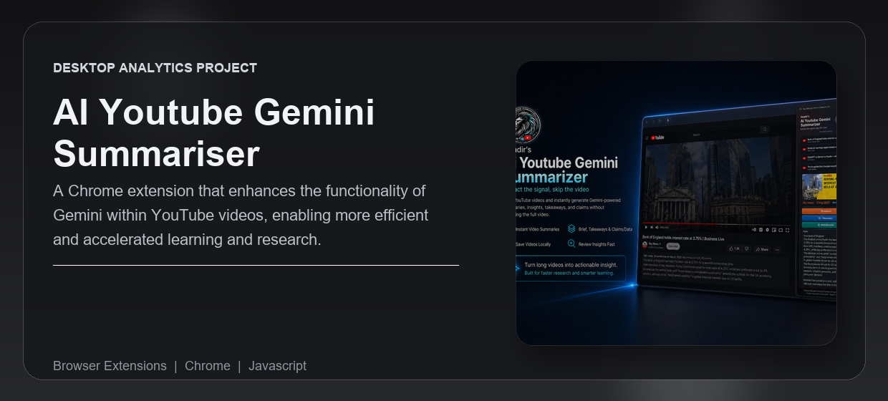

---
<div align="center">


<br /><br />

<p><strong>A Chrome extension that enhances the functionality of Gemini within YouTube videos, enabling more efficient and accelerated learning and research.</strong></p>

<p>Built for researchers, students, analysts, and heavy YouTube users who need the value from long videos without wasting time watching every minute.</p>

<p>
  <a href="#overview">Overview</a> |
  <a href="#what-problem-it-solves">What It Solves</a> |
  <a href="#feature-highlights">Features</a> |
  <a href="#screenshots">Screenshots</a> |
  <a href="#quick-start">Quick Start</a> |
  <a href="#tech-stack">Tech Stack</a>
</p>

<h3><strong>Made by Naadir | April 2026</strong></h3>

</div>

---

## Overview

AI YouTube Gemini Summariser is a Chrome extension that connects directly to YouTube's Gemini panel and turns any active YouTube video into structured summaries, takeaways, and claims/data analysis.

The extension detects the active YouTube video, pulls the title, channel, URL, thumbnail, and video ID, then sends controlled prompts to Gemini from inside the YouTube page. Responses are captured, cleaned, stored locally, and displayed in a side panel for quick review.

The practical result is faster learning and research. Instead of manually watching, pausing, copying notes, and deciding whether a video is worth your time, the extension gives you a reusable summary record with the most useful information already extracted.

## What Problem It Solves

- Removes the need to watch full YouTube videos just to understand whether they are useful
- Replaces manual note-taking, timestamp scanning, and copy-pasting with one-click Gemini prompts
- Makes video value clearer by separating summaries, key takeaways, claims, evidence, caveats, and watch/skim/skip decisions
- Gives a faster workflow than the default YouTube/Gemini experience because useful responses are saved locally and organized by video

### At a glance

| Track | Analyse | Compare |
|---|---|---|
| Saved YouTube videos | Gemini-generated summaries, takeaways, and claims/data | Brief vs Takeaways vs Claims/Data responses |
| Active video metadata and saved response state | Prompt output transformed into structured research notes | Full video watching vs extracted insight review |
| Local browser storage for saved videos and responses | Side-panel cards with prompt outputs | Time cost vs information value |

## Feature Highlights

- **Active video detection**, automatically reads the current YouTube watch page and prepares it for summarisation
- **Gemini prompt automation**, sends structured prompts into YouTube's Gemini panel without manual copy-paste
- **Three research modes**, generates Brief, Takeaways, and Claims/Data outputs for different levels of analysis
- **Local saved history**, stores videos and responses in Chrome local storage so useful summaries remain accessible
- **Expandable side-panel cards**, keeps saved videos organised with title, channel, thumbnail, prompt buttons, and generated responses
- **Evidence-focused analysis**, captures claims, data points, caveats, and watch/skim/skip recommendations for faster judgment

### Core capabilities

| Area | What it gives you |
|---|---|
| **Video capture** | Current YouTube video metadata, thumbnail, URL, channel, and saved state |
| **Prompt execution** | One-click Gemini prompts for summaries, takeaways, and claims/data review |
| **Saved responses** | Persistent local records of generated insights per video |
| **Research workflow** | A faster way to decide what to watch, skim, skip, or investigate further |

## Screenshots

<details>
<summary><strong>Open screenshot gallery</strong></summary>

<br />

<div align="center">
  
  <br /><br />
  
  <br /><br />
  
</div>

</details>

## Quick Start

```bash
# Clone the repo
git clone https://github.com/Naadir-Dev-Portfolio/AI-YouTube-Gemini-Summariser.git
cd AI-YouTube-Gemini-Summariser

# Install dependencies
No install step required

# Run
Load the folder as an unpacked extension in Chrome
```

No API keys are required. The extension uses YouTube's Gemini panel in the active browser session and stores saved videos and generated responses locally in Chrome storage.

## Tech Stack

<details>
<summary><strong>Open tech stack</strong></summary>

<br />

| Category | Tools |
|---|---|
| **Primary stack** | `JavaScript` | `HTML` | `CSS` |
| **UI / App layer** | Chrome Extension side panel, content script, browser action |
| **Data / Storage** | Chrome local storage, YouTube video metadata, saved Gemini responses |
| **Automation / Integration** | YouTube page DOM integration, Gemini prompt automation, Chrome Extensions API |
| **Platform** | Chrome / Chromium browsers |

</details>

## Architecture & Data

<details>
<summary><strong>Open architecture and data details</strong></summary>

<br />

### Application model

The extension starts from the active YouTube watch tab. The content script extracts the video title, channel, URL, video ID, thumbnail, and favicon, then exposes this data to the side panel.

When the user selects a prompt, the side panel sends a message to the content script. The content script opens or targets YouTube's Gemini prompt box, inserts the selected prompt, submits it, waits for the response to stabilize, then returns the generated text.

The side panel saves the response against the video record in Chrome local storage. Each saved video becomes an expandable card with prompt buttons, saved response count, active-tab status, thumbnail preview, and generated output.

### Project structure

```text
AI-YouTube-Gemini-Summariser/
+-- manifest.json
+-- background.js
+-- content.js
+-- sidepanel.html
+-- sidepanel.js
+-- styles.css
+-- icon/
|   +-- ai_youtube_summarizer_logo.png
+-- README.md
+-- repo-card.png
+-- screens/
|   +-- screen1.png
+-- portfolio/
    +-- ai-youtube-gemini-summariser.json
    +-- ai-youtube-gemini-summariser.webp
```

### Data / system notes

- Saved videos and generated responses are persisted in Chrome local storage under the extension's storage namespace.
- No external API key is used; prompts run through YouTube's Gemini panel in the user's browser session.
- The extension depends on YouTube page structure and Gemini panel selectors, so selector changes on YouTube may require maintenance.

</details>

## Contact

Questions, feedback, or collaboration: `naadir.dev.mail@gmail.com`

<sub>JavaScript | HTML | CSS</sub>

---
